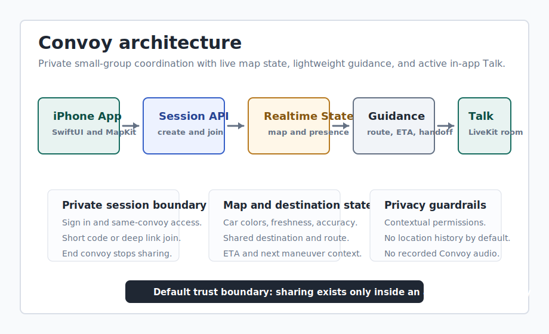

# Convoy

Convoy is a realtime iOS group navigation app for small private groups who deliberately start a drive together. The product line is "Stay close, even apart."

Source private during active development; technical walkthrough available on request.

[Portfolio case study](https://stickkb.github.io/projects/convoy.html)

## 20-second summary

Convoy coordinates a private driving group with create/join flows, shared map state, optional destination, route and ETA context, active in-app press-and-hold Talk, and an explicit end flow that stops sharing.

## Product problem

People driving separately often coordinate through texts, calls, screenshots, and separate navigation apps. Convoy narrows that into a deliberate private session: start a convoy, invite the group, coordinate while the drive is active, and stop sharing when the convoy ends.

## Realtime/mobile workflow

1. Create a private convoy session.
2. Join by short code or shareable deep link.
3. View members as distinct car markers with freshness and accuracy state.
4. Set an optional shared destination and show route, ETA, and next maneuver context.
5. Use active in-app press-and-hold Talk while the convoy is active.
6. End the convoy so local location, route, destination, and Talk state clears.

## Architecture

The public-safe architecture is a SwiftUI iPhone client over managed realtime services. MapKit and Core Location own map, route, and location behavior. Supabase owns auth, session records, membership boundaries, Edge Functions, Broadcast, Presence, and RLS-backed access control. LiveKit owns active convoy voice rooms through backend-issued short-lived tokens.

## Tech stack

- SwiftUI native iPhone app.
- MapKit route overlays, ETA, next maneuver text, and Apple Maps fallback.
- Core Location with permission requests scoped to active convoy use.
- Supabase Auth, Postgres, RLS, Edge Functions, Broadcast, and Presence.
- LiveKit active in-app press-and-hold Talk.
- APNs notification contract deferred until runtime hardening.

## Safe state/API overview

The public-safe model is category-level:

- Convoy sessions, status, and membership.
- Join codes, roles, and same-convoy access boundaries.
- Latest member state for map position, heading, speed, freshness, accuracy, and reconnect behavior.
- Optional shared destination plus route and ETA context.
- Realtime Broadcast and Presence channel contracts.
- User display names, editable nicknames, and distinct car colors.
- LiveKit room identity and short-lived token issuance.
- Privacy/deletion flows and end-convoy stop-sharing behavior.

Raw endpoint specs, table definitions, policies, secrets, and source code stay private.

## What I built

I shaped Convoy around a deliberately started private session, built the deterministic prototype loop, modeled create/join/session state, mapped member identity to distinct car markers, planned the realtime and voice boundaries, and kept privacy/App Review constraints visible while runtime integrations were staged.

## Verification

Verification includes prototype journey checks, static milestone scripts, Swift/XCTest source coverage, Supabase RLS test outlines, copy/privacy reviews, and explicit runtime blockers for Mac/Xcode, Supabase, LiveKit, and device or simulator validation.

## Trade-offs

- Lightweight MapKit guidance plus Apple Maps fallback keeps the MVP smaller than a full embedded navigation app.
- Active in-app Talk avoids the complexity and review risk of background or lock-screen walkie-talkie behavior.
- Supabase state and LiveKit voice split map coordination from audio transport.
- No location history by default lowers privacy risk but limits playback and debugging.

## Current rough edges

- Runtime validation still needs Mac/Xcode, Supabase, LiveKit, and device or simulator access.
- Supabase Broadcast/Presence, LiveKit audio, and Sign in with Apple need full integration testing.
- Public demo media is pending because screenshots and walkthroughs must avoid sensitive location or identity data.

## Roadmap

1. Wire Sign in with Apple into the beta auth flow.
2. Connect create/join state to Supabase realtime with same-convoy authorization.
3. Validate two-device map, destination, route, and end-convoy flows.
4. Validate LiveKit room join, press/release mute behavior, and convoy-end disconnect.
5. Finish hosted privacy/deletion URLs and private beta readiness checks.

## Demo media pending

Planned demo: a simulator or device walkthrough showing create/join, live map state, shared destination, route and ETA context, active Talk state, and end-convoy cleanup. Until that recording is safe to publish, this README uses architecture and workflow evidence instead of media claims.
